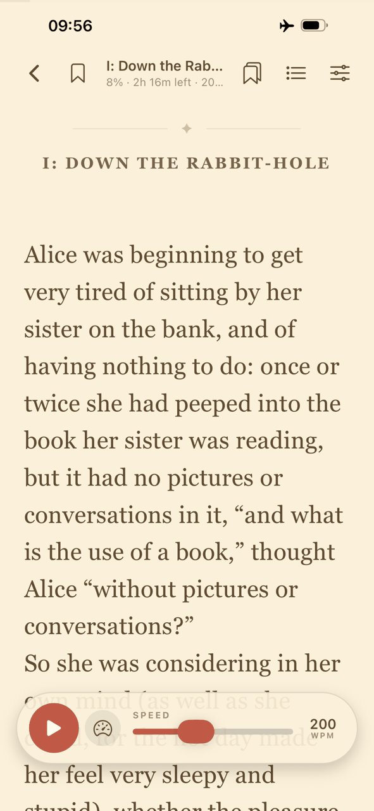

# Own Shelf

An iPhone app that opens EPUB books and scrolls the text at a steady pace, like a teleprompter, so you can read hands-free.

Play books, or just scroll.

Your books never leave the phone. Own Shelf has no account, no cloud, and no tracking. [Privacy policy](https://buildsbydt.github.io/ownshelf-epub-reader/) · [Support](mailto:buildsbydt@proton.me)

## Demo

https://github.com/user-attachments/assets/d8c6010d-4e27-4e14-95e1-48f91f990574

## Screenshots

  

## The problem

Most ebook apps are built for tapping through pages which is cumbersome when you want to read-hands free. You also have no indication of your reading-pace.

Manual page turn readers also tend to hide the book behind accounts, stores, and recommendations. I wanted something quieter: open a file I already own, set a pace, and let the text move.

## What I built

Own Shelf is a focused EPUB reader for iPhone.

- **Import a book from Files.** Own Shelf opens the EPUB on the phone, pulls out the cover, chapters, and text, and adds it to a local library. Nothing is uploaded.
- **Read as a teleprompter.** Text scrolls in a straight line at a speed you choose (about 60 to 450 words per minute). Tap to pause. Tap to start again.
- **See where you are.** A thin bar shows percent read, time left, and current speed, then gets out of the way.
- **Jump around.** Open the chapter list, skip past the copyright page, or bookmark a line and return to it later.
- **Keep a streak.** A few minutes of reading a day counts. The library shows your current streak, the next badge, and a simple week chart.
- **Pick up where you left off.** Each book remembers the exact place in the text, even after you change the font size.

I designed, built, tested, and submitted it myself.

## Stack

Own Shelf is a **React Native** app, written in **TypeScript**, shipped with **Expo**. That means one codebase that talks to iOS directly, without a separate backend.

There is no server to run or pay for. An EPUB is a zip file of web pages. Own Shelf unzips it on the phone, reads the table of contents, and turns the chapters into one long string of text. Settings, bookmarks, and reading position are stored in the app's own files.

I also use a windowed list (Shopify's FlashList) so a long book does not try to draw every chapter at once. Only the stretch of text on screen is drawn, plus a little either side.

## Architecture

**1. Keep a place in the book, not on the screen.**  
A bookmark is stored as "character 12,431 of this book," not "800 pixels down." Pixel positions break when you change font size or phone. Character positions do not. The same number drives resume, bookmarks, the progress bar, and chapter jumps.

**2. Only draw what you can see.**  
A novel is too long to lay out in one go. The list measures the chapter you are looking at, and estimates the rest from character counts. As you scroll, estimates get replaced with real heights, and the progress bar and time-left label stay accurate.

**3. Do the work on the device.**  
Opening a book, parsing it, saving position, and rendering text all happen on the iPhone. That keeps the privacy story simple, and it means the reader still works on a plane.

## Hardest bug: opening a book in the middle of a chapter

The obvious save is "how far have you scrolled, in pixels." That fails as soon as the font changes, and it also fails on a long book: chapters that are not on screen do not have a real height yet, so pixel math for "40% through chapter 12" is a guess.

So Own Shelf saves a character position. Restoring it is the hard part.

1. Jump to the right chapter (the list can do that quickly).
2. Wait until that chapter is actually drawn and we know its real height.
3. Then scroll a little further, by how far through the chapter you were.

During step 2, the scroll view briefly reports the *start* of the chapter. If you save that, you overwrite the real position, and the next open dumps you at the chapter heading. That is what happened in TestFlight.

The fix was to stop saving while a jump is settling and then nudge from the chapter start once the chapter is on screen, instead of trusting guessed pixel positions for chapters that have never been drawn. The mapping between characters and screen positions lives in the reader's layout math (`sectionMetrics`).

## What's next

- Turn the phone sideways without losing your place
- Search inside the current book
- Optional reading reminders on the device
- PDF support

## License

MIT. Questions: [buildsbydt@proton.me](mailto:buildsbydt@proton.me)
